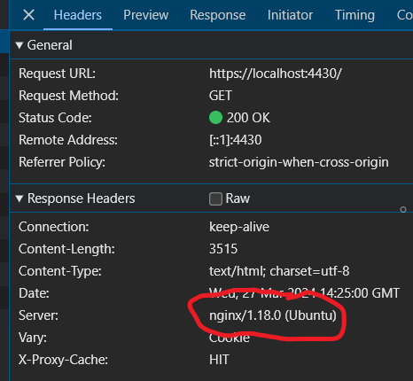

# Reverse proxy

## Docker Configuration

The reverse proxy is built using NGINX, an open-source web server and reverse proxy server. We use it as a reverse proxy server. The container copies the `nginx` folder including all it's contents into the docker image so if you want to add any files into the docker image of the reverse proxy, move the files over to the `nginx` folder.

### compose.yaml
The docker compose for the nginx (reverse proxy) image:
```yaml
  nginx:
    build: nginx
    hostname: nginx
    depends_on:
      - router
    privileged: true
    networks:
      switch-dmz-proxy:
        # ipv4_address: 10.0.1.1
    volumes:
      - /sys/fs/cgroup:/sys/fs/cgroup
      - './nginx:/etc/nginx'
    cap_add:
      - ALL
```

The reverse proxy itself is running on the private ip-adress `10.0.1.2` as defined in the [netplan.yaml](/nginx/init/netplan.yaml) and has a switch called switch-dmz-proxy (10.0.1.1) in the middle that is a bridge between the router and the reverse proxy.

## NGINX Configuration

This is the NGINX configuration file that is used for the configuring the reverse proxy.

### Events

The `events` block specifies the maximum number of connections that can be opened by Nginx workers.

### HTTP Server

The `http` block contains the server configuration for handling HTTP requests.

#### Caching
`proxy_cache_path` specifies the path to where the cache files are stored. The other values are variables that will change the configuration.

- `proxy_cache_path` - The path where the cache files will be stored.
- `keys_zone` - The name and size of the shared memory zone used for caching.
- `inactive` - The time period after which cached items are considered inactive and can be removed.
- `levels` - The directory structure of the cache storage.
- `max_size` - The maximum size of the cache storage.

#### Default Server

The first `server` block listens on port 80 and redirects all HTTP requests to HTTPS. This way all connections that come in at http are changed to https to allow for more secure communication

#### SSL Server

The second `server` block listens on port 443 and handles HTTPS requests. This is where all the secure traffic will be going and this will be the only way to access the website

##### SSL Certificate

The `ssl_certificate` points to the file myAwesemeServer.cer, this is the SSL certificate that the site uses for it's https traffic
The `ssl_certificate_key` points to the file myAwesomeServer.pvk which is the private key that is used for the https traffic.

### Reverse Proxying

The `location` blocks define the reverse proxy configuration for different paths.

NGINX will select the **longest matching** request. So only if the first 9 characters are dashboard (it doesn't matter what comes after) will it route to `192.168.2.10`

- The `/dashboard` location proxies requests to `http://192.168.2.10` (Dashboard).
- The `/` location proxies requests to `http://192.168.1.10` (SecretManager).

#### Caching
- `proxy_cache` Defines which proxy configuration to use, as we configured earlier that is NginxCache
- `proxy_cache_methods GET;` This will only cache GET requests.
- `proxy_cache_valid 200 10m;` This will only cache 200 status code requests (for 10 minutes as defined earlier)
- `add_header X-Proxy-Cache $upstream_cache_status;` is purely for debug purposes, you can check in the headers in your browser if the page was pulled from the cache or from the web server.

Keep all the proxy_header values the same, these do not need to be changed.

```nginx
events {
    worker_connections 1024;
}

http {
    proxy_cache_path /var/cache/nginx
                    keys_zone=NginxCache:20m
                    inactive=60m
                    levels=1:2
                    max_size=10g;
    
    server {
        listen 80 default_server;
        listen [::]:80 default_server;
        server_name localhost;
        return 301 https://$host:4430$request_uri;
    }

    server {
        listen 443 ssl default_server;
        listen [::]:443 ssl default_server;
        server_name localhost;

        ssl_certificate myAwesomeServer.cer; #path to cert
        ssl_certificate_key myAwesomeServer.pvk; #path to key

        location /dashboard {
            proxy_pass http://192.168.2.10;
            proxy_set_header Host $host;
            proxy_set_header X-Real-IP $remote_addr;
            proxy_set_header X-Forwarded-For $proxy_add_x_forwarded_for;
            proxy_set_header X-Forwarded-Proto $scheme;
            proxy_cache NginxCache;

            proxy_cache_methods GET;
            proxy_cache_valid 200 10m;

            add_header X-Proxy-Cache $upstream_cache_status;
        }

        location / {
            proxy_pass http://192.168.1.10;
            proxy_set_header Host $host;
            proxy_set_header X-Real-IP $remote_addr;
            proxy_set_header X-Forwarded-For $proxy_add_x_forwarded_for;
            proxy_set_header X-Forwarded-Proto $scheme;
            proxy_cache NginxCache;
            proxy_cache_methods GET;
            proxy_cache_valid 200 10m;

            add_header X-Proxy-Cache $upstream_cache_status;
        }
    }
}
```

## Renewing SSL certificate
To renew the SSL certificate, navigate to the nginx directory and delete the following files:
- myAwesomeServer.ext
- myAwesomeServer.pvk
- myAwesomeServer.req

Once deleted, execute these commands:
```sh
$ openssl req -x509 -newkey rsa:2048 -out myAwesomeCA.cer -outform PEM -keyout myAwesomeCA.pvk -days 10000 -verbose -config myAwesomeCA.cnf -nodes -sha256 -subj "/CN=MyCompany CA"
$ openssl req -newkey rsa:2048 -keyout myAwesomeServer.pvk -out myAwesomeServer.req -subj /CN=localhost -sha256 -nodes
$ openssl x509 -req -CA myAwesomeCA.cer -CAkey myAwesomeCA.pvk -in myAwesomeServer.req -out myAwesomeServer.cer -days 10000 -extfile myAwesomeServer.ext -sha256 -set_serial 0x1111
```
These will create a new SSL certificate based on the information that already exists in the folder

finally, check the validity of the new certificate by running:
```sh
$ openssl s_server -accept 15000 -cert myAwesomeServer.cer -key myAwesomeServer.pvk -CAfile myAwesomeCA.cer -WWW
```
And your SSL certificate is renewed!!!

## Debugging

Here are a few common errors and how to fix them.

### 1. Error 400 Bad Request (The plain HTTP request was send to HTTPS port)
To fix this issue:
1. Go to your browser and look at the search bar.
2. Double click on the URL to make the prefix (HTTP or HTTPS) appear
3. It should say HTTPS but if it says HTTP you will run into this issue so change it to HTTPS and you should be good to go.

### 2. Error 502 Bad Gateway
To fix this issue:
1. Go to the container of the site you are trying to access and open up the terminal.
2. In the terminal, check if the website is correctly running by executing:
```sh
$ curl $IP_ADRESS
```
And replace the ip adress with the ip address of that webserver.
- If the website returns the html as normal, try reloading the page in your browser or doing `docker compose down` and `docker compose up --build` in your project terminal.
- If the website does not return the html and instead gives an error like "connection refused" the webserver is not running. In that case, continue with these steps:
3. Navigate to the cs-bootstrap directory inside the docker terminal with this command
```sh
$ cd cs-bootstrap
```
4. Execute both runonce.sh and runalways.sh
```sh
$ ./runonce.sh && ./runalways.sh
```
And it should be up and running now!

If for some reason it is still not working. try:
5. Execute runalways.sh again
```sh
$ ./runalways.sh
```
#### Possible outcomes:
- If it executes without any error the web server is now running
- If it returns: "port already in use" then refresh the page in the browser, the server is up and running.
- If it returns: "memory segmentation error" then just wait, grap a cup of coffee and retry in 5 minutes, after that it should just work.
- If it returns "ImportError: no module named "x". install that library in the docker terminal by running:
```sh
$ pip install $library_name
```
After that, repeat step 5 and it should be working.

### No NGINX error page:
The issue is not in the reverse proxy but the traffic to and from, this is probably caused by the firewall so i suggest going there to fix the problem.


# Database Encryption

## What is Data Encryption?

Data encryption translates data into another form, or code, so that only people with access to a secret key (formally called a decryption key) or password can read it. Encrypted data is commonly referred to as ciphertext, while unencrypted data is called plaintext. Currently, encryption is one of the most popular and effective data security methods used by organizations. Two main types of data encryption exist - asymmetric encryption, also known as public-key encryption, and symmetric encryption.


## How does database encryption work?

With database encryption, an encryption algorithm transforms data within a database from a readable state into a ciphertext of unreadable characters. With a key generated by the algorithm, a user can decrypt the data and retrieve the usable information as needed. Unlike security methods like antivirus software or password protection, this form of defense is positioned at the level of the data itself. This is crucial because if a system is breached, the data is still only readable for users who have the right encryption keys. In this documentation we will be encrypting and decrypting the table "Secret" and specific the column "info". The column "info" stores and provides the user secrets/passwords.

## Fernet Encryption Procedures

In our encryption process we are using Fernet. Fernet guarantees that a message encrypted using it cannot be manipulated or read without the key. Fernet is an implementation of symmetric (also known as “secret key”) authenticated cryptography.


## Encryption Procedures

### Initializing Fernet
First, we initialize Fernet with the encryption key (`encKey`). This cryptographic key is essential for encryption and decryption operations. It must be a 32-byte URL-safe base64-encoded string. Keeping this key secure is crucial, as it is used for both encryption and decryption operations.
```yaml
# Initialize Fernet with the key
cipher_suite = Fernet(encKey)
```
### Encrypting Data

"def encrypt_data(data)" is a function which takes the data as input. This function is intended to encrypt the given data/secrets.
```yaml
# Function to encrypt data
def encrypt_data(data):
    flash(data, 'error')
```
"encrypted = cipher_suite.encrypt(data.encode())". This line performs the actual encryption. It takes the input data/secrets encodes it into bytes using UTF-8 encoding "(.encode())" and then encrypts it using the cipher_suite object that was initialized earlier. The result is stored in the encrypted variable.
```yaml
    encrypted = cipher_suite.encrypt(data.encode())
    return encrypted
```

### Decrypting Data
Here "decrypted_secrets" is initialized as an empty list. This will decrypt the encrypted secrets using the cipher_suite initialized earlier in the code above and store the decrypted secrets in this list.

```yaml
decrypted_secrets = []
```
Here we encode the secrets to bytes, then use the decrypt function to decrypt the secret and then decode it back to string. After that we combine that info back into 1 list of 4 variables putting thr decrypted secret in it's relevant position.
```yaml
for secret in secrets:

            secretEnc = secret[2].encode()
            decrypted_secret_info = cipher_suite.decrypt(secretEnc).decode()
            decrypted_secrets.append((secret[0], secret[1], decrypted_secret_info, secret[3]))
```

### Rendering Decrypted Secrets

"secrets=decrypted_secrets" contains the decrypted versions of the secrets retrieved from the database. before rendering the home page, the application decrypts the secrets retrieved from the database and then passes these decrypted secrets to the template for display.
```yaml
return render_template("home/index.html", logged_in=logged_in,
                        secrets=decrypted_secrets)
```

# Router/Firewall

## Description

This script sets up the network configuration and firewall rules for a router. It configures the network interfaces, sets up NAT for internet access, and defines firewall rules for traffic forwarding.

## Variables

```sh
# variables
EXT_IFACE="eth0"
DMZ_IFACE="eth3"
BLOK1_IFACE="eth1"
BLOK2_IFACE="eth2"
BLOK1_WEB="192.168.1.10"
BLOK2_WEB="192.168.2.10"
PROXY_IP="10.0.1.2"
ROUTER_IP="10.0.1.3"
```

- `EXT_IFACE`: The external interface (e.g., eth0) for internet access.
- `DMZ_IFACE`: The DMZ interface (e.g., eth3) for the DMZ network.
- `BLOK1_IFACE`: The interface (e.g., eth1) for the first block network.
- `BLOK2_IFACE`: The interface (e.g., eth2) for the second block network.
- `BLOK1_WEB`: The IP address (e.g., 192.168.1.10) of the web server in the first block network.
- `BLOK2_WEB`: The IP address (e.g., 192.168.2.10) of the web server in the second block network.
- `PROXY_IP`: The IP address (e.g., 10.0.1.2) of the reverse proxy.
- `ROUTER_IP`: The IP address (e.g., 10.0.1.3) of the router itself.

## Network Configuration

```sh
# blok 1
/sbin/ip address add 192.168.1.1/24 dev $BLOK1_IFACE
# blok 2
/sbin/ip address add 192.168.2.1/24 dev $BLOK2_IFACE
# we only add 30 addresses to the third block, because we only need 1 for the reverse proxy and 1 for the router
/sbin/ip address add 10.0.1.1/27 dev $DMZ_IFACE

# add NAT on all interfaces to allow internet access via eth0
/sbin/sysctl -w net.ipv4.ip_forward=1

/sbin/iptables -t nat -A POSTROUTING -o $EXT_IFACE -j MASQUERADE
```

- Assigns IP addresses to the interfaces using the `ip address add` command.
- Configures the DMZ interface with a /27 subnet.
- Enables IP forwarding using the `sysctl` command.
- Sets up MASQUERADE for internet access via the external interface.

## Firewall Rules

```sh
/sbin/iptables -A FORWARD -i eth0 -o eth3 -m state --state RELATED,ESTABLISHED -j ACCEPT
```
- Allows traffic from the external interface to the DMZ interface.
```sh
# traffic from reverse proxy
/sbin/iptables -A FORWARD -i eth3 -o eth0 -j ACCEPT
/sbin/iptables -A FORWARD -i eth3 -o eth1 -j ACCEPT
/sbin/iptables -A FORWARD -i eth3 -o eth2 -j ACCEPT
```
- Allows traffic from the reverse proxy to the external and block interfaces.
```sh
# traffic from webservers
/sbin/iptables -A FORWARD -i eth1 -o eth3 -j ACCEPT
/sbin/iptables -A FORWARD -i eth2 -o eth3 -j ACCEPT

# accept traffic to eth2 from outside
/sbin/iptables -A FORWARD -i eth0 -o eth2 -m state --state RELATED,ESTABLISHED -j ACCEPT
/sbin/iptables -A FORWARD -i eth2 -o eth0 -j ACCEPT

# accept traffic to eth1 from outside
/sbin/iptables -A FORWARD -i eth0 -o eth1 -m state --state RELATED,ESTABLISHED -j ACCEPT
/sbin/iptables -A FORWARD -i eth1 -o eth0 -j ACCEPT

```
- Allows traffic from the web servers to the DMZ interface.
```sh
# route to reverse proxy
/sbin/iptables -t nat -A PREROUTING -i eth0 -p tcp --dport 80 -j DNAT --to-destination $PROXY_IP:80
/sbin/iptables -A FORWARD -p tcp -d $PROXY_IP --dport 80 -m state --state NEW,ESTABLISHED,RELATED -j ACCEPT


/sbin/iptables -t nat -A PREROUTING -i eth0 -p tcp --dport 443 -j DNAT --to-destination $PROXY_IP:443
/sbin/iptables -A FORWARD -p tcp -d $PROXY_IP --dport 443 -m state --state NEW,ESTABLISHED,RELATED -j ACCEPT
```
- Allows traffic to the reverse proxy on ports 80 and 443.
```sh
# allow icmp traffic to router
/sbin/iptables -t nat -A PREROUTING -i eth0 -p icmp -j DNAT --to-destination $ROUTER_IP
/sbin/iptables -A FORWARD -p icmp -d $ROUTER_IP -m state --state NEW,ESTABLISHED,RELATED -j ACCEPT
```
- Allows ICMP traffic to the router.
```sh
# allow ssh traffic to router
/sbin/iptables -t nat -A PREROUTING -i eth0 -p tcp --dport 22 -j DNAT --to-destination $ROUTER_IP
/sbin/iptables -A FORWARD -p tcp -d $ROUTER_IP --dport 22 -m state --state NEW,ESTABLISHED,RELATED -j ACCEPT
```
- Allows SSH traffic to the router.
```sh
# drop all
/sbin/iptables -A FORWARD -j DROP
```
- Drops all other traffic.

## Testing the Firewall
We can test the firewall by trying to reach the web server 1 from web server 2, that way we know the individual web servers are isolated from eachtother through the configuration of the router.

ping to web server 1 from web server 2
```
root@web-blok2:/opt/init# ping 192.168.1.10
PING 192.168.1.10 (192.168.1.10) 56(84) bytes of data.
^C
--- 192.168.1.10 ping statistics ---
6 packets transmitted, 0 received, 100% packet loss, time 5176ms
```

As you see it's not working, but when i ping from the router:
```
# ping 192.168.1.10
PING 192.168.1.10 (192.168.1.10) 56(84) bytes of data.
64 bytes from 192.168.1.10: icmp_seq=1 ttl=64 time=4.32 ms
64 bytes from 192.168.1.10: icmp_seq=2 ttl=64 time=0.674 ms
64 bytes from 192.168.1.10: icmp_seq=3 ttl=64 time=1.23 ms
^C
--- 192.168.1.10 ping statistics ---
3 packets transmitted, 3 received, 0% packet loss, time 2003ms
rtt min/avg/max/mdev = 0.674/2.074/4.316/1.601 ms
```
It does work. This means that the configuration is successful

# DMZ

## Description

Setting up a DMZ is very important for the safety of your web servers. The DMZ usually refers to side or part of the network that is open to the public. That is accessible to everyone without heavy firewall restrictions. Our DMZ only contains our reverse proxy which acts as a gateway between the outside world and our internal network. 

## Traffic

### Router

All incoming HTTP and HTTPS requests are forwarded to the DMZ which is done through the firewall with the following iptables rules:
```sh
# Forward HTTP traffic to reverse proxy(DMZ)
/sbin/iptables -t nat -A PREROUTING -i eth0 -p tcp --dport 80 -j DNAT --to-destination $PROXY_IP:80
/sbin/iptables -A FORWARD -p tcp -d $PROXY_IP --dport 80 -m state --state NEW,ESTABLISHED,RELATED -j ACCEPT

# Forward HTTPS traffic to reverse proxy(DMZ)
/sbin/iptables -t nat -A PREROUTING -i eth0 -p tcp --dport 443 -j DNAT --to-destination $PROXY_IP:443
/sbin/iptables -A FORWARD -p tcp -d $PROXY_IP --dport 443 -m state --state NEW,ESTABLISHED,RELATED -j ACCEPT
```
This way no HTTP or HTTPS traffic can directly reach the web servers, adding an extra layer of safety.

### Reverse proxy

The reverse proxy is the only interface that is inside of the DMZ, all requests to the web servers will be done by the reverse proxy. It sort of acts like a postman. It looks at the request URL to see which web server to send a request too and if it already has that paged stored it will return the cached page. For more information on the configuration of the reverse proxy read [here.](#nginx-configuration)

## Testing
To make sure this configuration is working and the requests are properly being sent from the reverse proxy you can open up inspect with F12. Then on the top, click on "Network". Refresh the page and click on "localhost" in the right middle of the screen. When you look at the response headers you see that the server is NGINX, in other words, our reverse proxy.




Because all HTTP and HTTPS requests are forwarded to the reverse proxy, i can't reach the web servers directly from outside, you don't have to test this because it's not possible.


# IDS (SNORT)
## Setup
Installing Snort on the router:
```sh
$ apt install snort
$ cd ..
$ cd ..
$ ls
$ cd etc
$ ls
$ cd snort
$ ls
$ cd rules
$ apt install nano
$ ls
$ nano local.rules
```
When asked for the interface, fill in `eth0`
When asked for the host, fill in `172.16.3.2/24`

After doing this in the terminal, i added snort rules in the local.rules

Rules for local.rules:

alert icmp any any -> any any (msg:"ICMP detected"; sid:1000001;)
alert udp any any -> any any (msg:"UDP traffic detected"; sid:1000008;)

alert tcp any any -> any 22 (msg:"SSH bruteforce detected"; content:"Failed password"; sid:1000002;)
drop tcp any any -> any 22 (msg:"Blocking SSH traffic"; sid:1000006;)
alert tcp any any -> any 80 (msg:"HTTP bruteforce detected"; content:"POST"; sid:1000003;)

drop tcp any any -> any any (msg:"Blocking traffic with specific payload"; content:"malicious_pattern"; sid:1000007;)
drop udp any any -> any any (msg:"Blocking UDP traffic"; sid:1000009;)


## What do these rules mean:

Alert = means a Notification is generated when the defined pattern is detected.

Any any -> any any = In this case, "any any" represents each IP address and port as source and destination, meaning that the rule applies to all ICMP traffic to and from each IP address and port.

Msg = This is the message displayed when the rule is activated. 

Sid = This is the unique identification number of the rule, also called the Signature ID (SID). It is used to distinguish the rule from other rules and can be used to track and document events in the log.

After adding the rules i had to see if it worked, so i needed to run Snort and the alerts output to the console. For this i used this command:

`snort -i eth0 -i eth1 -i eth2 -i eth3 -c /etc/snort/snort.conf -A console`

## What does this command mean?:

-i eth0 -i eth1 -i eth2 -i eth3 = These are the interfaces on which Snort will monitor network traffic. "eth0," "eth1," "eth2" and "eth3" are the interface names for the various network interfaces on the system. This command tells Snort to check the network traffic on all of these interfaces.

-c /etc/snort/snort.conf = This specifies the path to Snort's configuration file. In this case, the configuration file can be found at the location "/etc/snort/snort.conf". The configuration file contains the settings and rules that Snort will use to analyze network traffic and generate notifications if necessary.

-A console: This indicates that Snort should display notifications on the console instead of writing them to a log file. When Snort detects an intrusion, it will display the details of the detection on the console of the system on which Snort is running.

I had to test if IDS works. So i pinged 8.8.8.8 via the terminal. This is what the outcome was:
```
03/26-13:14:29.397065  [**] [1:1000001:0] ICMP detected [**] [Priority: 0] {ICMP} 172.16.3.2 -> 8.8.8.8
03/26-13:14:29.404726  [**] [1:1000001:0] ICMP detected [**] [Priority: 0] {ICMP} 8.8.8.8 -> 172.16.3.2
```
In webblok 1, i installed telnet to see what the output will be in the router. This was the outcome:

03/26-13:16:30.803805  [**] [1:1000008:0] UDP traffic detected [**] [Priority: 0] {UDP} 172.16.3.2:56163 -> 192.168.65.7:53

Sources:

- [Github](https://github.com/John-Lin/docker-snort)
- [Github](https://github.com/dnif-archive/docker-snort)
